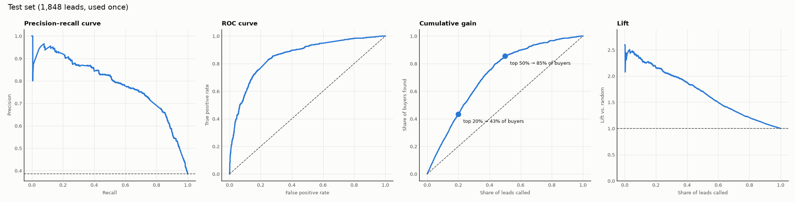
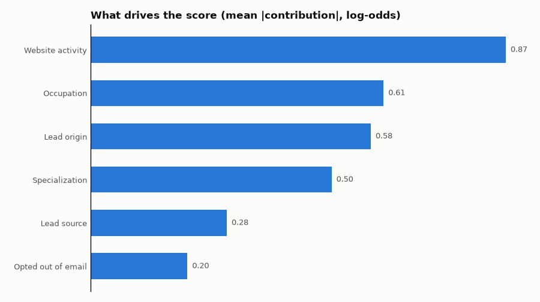

# Aurynix Apex — Lead Propensity Engine

> Surface the apex of your pipeline: predict which leads will convert, so sales teams call the right people first.


[](https://github.com/Aurynix/aurynix-apex/actions/workflows/ci-cd.yml)


**Aurynix Apex** is an end-to-end machine learning system that:

1. Scores every lead with a **probability of conversion**.
2. Groups leads into **High / Medium / Low** priority segments based on sales-team capacity.
3. Explains **why** each lead received its score.
4. Monitors itself in production for **data drift** and **score drift**, and signals when retraining is needed.

It is the scoring engine behind **[Aurynix Pulse](#how-it-fits-into-aurynix-pulse)**, an AI lead qualification platform.

> ✅ **v0.2.0.** All build steps are done ([BUILD_STEPS.md](BUILD_STEPS.md)); changes per version in [CHANGELOG.md](CHANGELOG.md). On a held-out test set, the top 20% of scored leads hold **43%** of all buyers, and **83%** of calls in that group reach a buyer (random: 38%). See [Results](#results).

---

## Table of Contents

- [The Problem](#the-problem)
- [The Solution](#the-solution)
- [How It Fits Into Aurynix Pulse](#how-it-fits-into-aurynix-pulse)
- [Dataset](#dataset)
- [System Architecture](#system-architecture)
- [ML Pipeline](#ml-pipeline)
- [Data Leakage Policy](#data-leakage-policy)
- [Results](#results)
- [Second Dataset: Bank Marketing](#second-dataset-bank-marketing)
- [Evaluation Strategy](#evaluation-strategy)
- [Lead Segmentation](#lead-segmentation)
- [Explainability](#explainability)
- [API](#api)
- [Monitoring: Data Drift & Score Drift](#monitoring-data-drift--score-drift)
- [Tech Stack](#tech-stack)
- [Project Structure](#project-structure)
- [Getting Started](#getting-started)
- [Make Targets](#make-targets)
- [Configuration](#configuration)
- [Roadmap](#roadmap)
- [Design Decisions](#design-decisions)
- [Author](#author)
- [License](#license)

---

## The Problem

A company receives hundreds or thousands of leads every month from ads, web forms, and sign-ups. Its sales team (SDRs) can only contact a fraction of them.

Without data-driven prioritization:

- Time is wasted on leads who were "just asking."
- High-intent buyers wait too long and go to a competitor.
- Manual rule-based scoring in CRMs (e.g. *"+10 points for visiting the pricing page"*) relies on guesswork, not evidence.
- Nobody notices when the type of incoming leads changes and the scoring rules quietly stop working.

## The Solution

Aurynix Apex learns from historical leads whose outcome is known, then predicts the outcome of new ones.

For every lead it returns:

| Output | Example |
|---|---|
| Conversion probability | `0.82` |
| Priority segment | `High` |
| Top reasons | Visited the website 6 times · Came from Google Ads · Spent 25 minutes on site |
| Model version | `apex-v1.0.0` |

**Example ranking:**

| Lead | Source | Visits | Time on site | Score | Segment |
|---|---|---|---|---|---|
| Lead A | Google Ads | 6 | 25 min | 0.82 | 🟢 High |
| Lead B | Organic search | 3 | 8 min | 0.41 | 🟡 Medium |
| Lead C | Facebook | 1 | 2 min | 0.09 | 🔴 Low |

*(Illustrative example, not model output.)*

## How It Fits Into Aurynix Pulse

```
 WhatsApp ─┐
 Web Form ─┼──▶  Aurynix Pulse  ──▶  Aurynix Apex  ──▶  Ranked leads + reasons
 CSV       ─┘    (collects &          (scores,            for the sales team
                  unifies leads)       explains,
                                       monitors)
                        ▲                                      │
                        └──── sales outcomes & corrections ◀───┘
                              (become new training labels)
```

| Product | Role |
|---|---|
| **Aurynix Nexus** | AI chat and dashboard platform |
| **Aurynix Pulse** | Collects leads from every channel into one unified profile |
| **Aurynix Apex** | Scores, ranks, and explains leads, and monitors model health |

## Dataset

### Primary: Lead Scoring Dataset (X Education)
- Source: Kaggle, [`amritachatterjee09/lead-scoring-dataset`](https://www.kaggle.com/datasets/amritachatterjee09/lead-scoring-dataset) (saved as `data/raw/Leads.csv` by `make data-download`)
- About 9,000 real leads from an online education company
- Features: lead origin and source, website activity, demographics, engagement
- Target: `Converted` (1 = converted, 0 = did not convert)

**Known data issues to handle:**
- The placeholder value `"Select"` means the user did not choose an option. It is treated as missing.
- Several columns may be filled in by sales **after** contact (see [Data Leakage Policy](#data-leakage-policy)).

### Secondary: Bank Marketing Dataset (UCI, id 222)
- Used to prove the pipeline is reusable on a second, highly imbalanced dataset.
- Contains a well-known leakage feature (`duration`, the call length, only known after the call).
- 45,211 clients, 11.7% subscribed. Results: [Second Dataset](#second-dataset-bank-marketing) and [docs/bank_marketing.md](docs/bank_marketing.md).

> Raw data is never committed to this repository.

## System Architecture

```
                        ┌──────────────── Training (make pipeline) ────────────────┐
 data/raw/Leads.csv ──▶ │ clean ─▶ features ─▶ split ─▶ train ─▶ evaluate ─▶ save  │
                        └──────────────────────────────────────────────┬───────────┘
                                                                       ▼
                     models/  model.pkl · model_meta.json · reference_profile.json · model_card.json
                                       │ (loaded once, read-only)
                                       ▼
 Client / Pulse ──▶ FastAPI routers ──▶ ScoringService: score ─▶ segment ─▶ explain ─▶ log
 Streamlit demo ──▶  (validate only)                                                 │
                                                                                      ▼
                     SQLite (data/apex.db): predictions · rejected_requests ──▶ Monitor
                                                                                  │
                                         drift_runs · reports/monitoring/latest.json ◀┘
```

Training and serving are separate: the API only loads the saved model and never trains ([ADR-006](docs/decisions.md)).

## ML Pipeline

| # | Stage | Key Activities | Output |
|---|---|---|---|
| 1 | **Problem Framing** | Define target, prediction moment, business success criteria | [problem_framing.md](docs/problem_framing.md) |
| 2 | **Data Collection** | Download and document raw datasets | [data_dictionary.md](docs/data_dictionary.md) §1 |
| 3 | **Data Quality & EDA** | Missing values, hidden nulls (`"Select"`), duplicates, outliers, class balance, feature–target relationships | [data_quality.md](docs/data_quality.md), [data_cleaning.md](docs/data_cleaning.md), [eda.md](docs/eda.md) |
| 4 | **Leakage Audit** | Classify every column as available or not available at lead creation | [data_dictionary.md](docs/data_dictionary.md) §2, ADR-001 |
| 5 | **Preprocessing & Feature Engineering** | `sklearn` `Pipeline` + `ColumnTransformer`, rare-category grouping, engineered features | [features.md](docs/features.md) |
| 6 | **Data Splitting** | Stratified train / validation / test; test set used once | [splits.md](docs/splits.md) |
| 7 | **Baseline** | Majority-class baseline and Logistic Regression | [models.md](docs/models.md) 2.3 |
| 8 | **Cross-validation & Feature Selection** | Stratified 5-fold CV; keep the simplest feature set that scores the same; tracked in MLflow | [models.md](docs/models.md) 2.4 |
| 9 | **Tuning** | Grid search over Logistic Regression `C` and class weights, with cross-validation | [models.md](docs/models.md) 2.5, ADR-004 |
| 10 | **Evaluation & Calibration** | PR-AUC, ROC-AUC, lift/gain, calibration curve, Brier score | [models.md](docs/models.md) 3.1–3.2 |
| 11 | **Segmentation** | Map probabilities to High / Medium / Low using sales capacity | [models.md](docs/models.md) 3.3 |
| 12 | **Explainability** | Global and per-lead explanations (exact linear SHAP) | [models.md](docs/models.md) 3.4 |
| 13 | **Serving** | FastAPI service, prediction logging, Docker, Streamlit demo | [api.md](docs/api.md), [deployment.md](docs/deployment.md) |
| 14 | **Monitoring** | Feature drift, prediction drift (PSI), data quality; drift simulation | [monitoring.md](docs/monitoring.md) |

## Data Leakage Policy

Every feature must pass one test:

> **Is this information available at the moment the lead is created, before any sales contact?**

If not, it is removed and documented ([data_dictionary.md](docs/data_dictionary.md) §2, [ADR-001](docs/decisions.md)). Result of the audit:

| Column | Why it leaks | Evidence (quick model, PR-AUC gain) | Status |
|---|---|---|---|
| `Tags` | Sales status after contact ("Closed by Horizzon", "Ringing") | **+0.148** | ❌ Removed |
| `Lead Quality` | Sales rep's judgment of the lead | +0.061 | ❌ Removed |
| `Last Activity`, `Last Notable Activity` | Activity at export time, incl. sales actions (`SMS Sent`) | +0.036 | ❌ Removed |
| `Asymmetrique` index / score (4 columns) | Assigned scores, timing unknown | +0.022 | ❌ Removed |
| `Lead Profile` | Assigned label ("Potential Lead") | +0.020 | ❌ Removed |
| Website visits, time on site | Could include visits after contact (no timestamps) | smooth pattern, not a near-perfect split | ⚠️ Kept, risk documented |
| `Lead Origin = Lead Add Form` | 92.5% convert; may be added by sales after a call | origin is known at creation | ⚠️ Kept, risk in model card |

A model that suddenly scores 95%+ is treated as a leakage warning, not a success.

## Results

Final model: **Logistic Regression** on 24 features built from 7 raw lead fields ([ADR-003](docs/decisions.md), [ADR-004](docs/decisions.md)). Fitted on train + validation (7,392 leads) and evaluated **once** on the held-out test set (1,848 leads, step 3.1).

| Metric | No skill | **Test** | Target |
|---|---|---|---|
| PR-AUC | 0.385 | **0.787** (95% CI 0.756–0.816) | far above no skill ✅ |
| ROC-AUC | 0.500 | **0.855** | < 0.95 (no leakage alarm) ✅ |
| Brier score | 0.237 | **0.149** | below no skill ✅ |
| Calibration error (ECE, out-of-fold) | — | **0.031** | ≤ 0.05 ✅ |
| Buyers found in the top 20% (recall) | 20% | **43.3%** (lift 2.16) | ≥ 40% ✅ |
| Calls that reach a buyer in the top 20% (precision) | 38.5% | **83.2%** | — |
| Buyers found in the top 50% (recall) | 50% | **85.4%** | ≥ 80% ✅ |

**In plain words:** if the sales team calls only the top-scored 20% of new leads, more than 8 in 10 calls reach a future customer, and those calls find 43% of all customers. Calling at random reaches fewer than 4 in 10 and finds 20%.



**Model card:** [`models/model_card.json`](models/model_card.json): data, algorithm, performance, risk rating (overall **Low**), limitations, and monitoring plan.

The test score is lower than validation (0.839) and cross-validation (0.818 ± 0.011). The test leads have the same mix as the other splits, and the 95% intervals of validation and test meet near the CV average, so this is sampling variation; the expected PR-AUC on new leads is about **0.80 ± 0.03**. Details: [docs/models.md](docs/models.md).

---

## Second Dataset: Bank Marketing

The same pipeline, run on UCI Bank Marketing with **configuration only** (`APEX_CONFIG=config_bank.json`): 45,211 bank clients, 11.7% subscribed to a term deposit after a phone campaign. Full report: [docs/bank_marketing.md](docs/bank_marketing.md).

| | Leads | Bank Marketing |
|---|---|---|
| Rows · conversion | 9,240 · 38.5% | 45,211 · 11.7% |
| Leakage caught by the with/without check | `Tags` (+0.148 PR-AUC) | **`duration`** (+0.16), the call length, known only after the call |
| Test PR-AUC (vs. random) | 0.787 (2.0×) | 0.359 (3.1×) |
| Top 20%: share of calls that convert · share of all conversions | 83% · 43% | 29% · 49% |
| High vs. Low conversion | 84% vs. 12% | 29% vs. 6% |
| Same settings held | — | Logistic Regression, `C = 1`, no class weights, raw probabilities |

The bank file is in date order, which allowed a **time check**: trained on older clients and tested on newer ones, the ranking holds (ROC-AUC 0.726 → 0.707) but conversion jumps from 7% to 32%, so probabilities drift. That is why Apex monitors real outcomes and recommends retraining ([ADR-008](docs/decisions.md)).

---

## Evaluation Strategy

Conversion data is typically imbalanced, so accuracy alone is misleading.

| Metric | Why it matters |
|---|---|
| **PR-AUC** (primary) | Focuses on finding the positive class (converters) |
| **ROC-AUC** | Overall ranking quality |
| **Lift / Cumulative Gain** | Business view: *"the top 20% of scored leads capture X% of conversions"* |
| **Calibration curve & Brier score** | A predicted 0.70 should mean roughly 70% actually convert |
| **Precision / Recall at threshold** | Tied to how many leads the team can actually contact |

**Rules:**
- Every model must beat the baseline to be considered.
- The test set is evaluated exactly once, at the end.
- All experiments are logged in MLflow (parameters, metrics, artifacts).

## Lead Segmentation

Segments are based on **sales-team capacity**, not arbitrary probability cut-offs.

Example: if the team can contact 20% of leads, the top 20% of scores are **High**.

| Segment | Share of leads | Score | Action |
|---|---|---|---|
| 🟢 High | Top 20% | ≥ 0.751 | Contact first, same day |
| 🟡 Medium | Next 30% | 0.270 – 0.751 | Follow up within the week |
| 🔴 Low | Bottom 50% | < 0.270 | Automated nurturing (email sequences) |

Results on the held-out test set (1,848 leads, `make segments`):

| Segment | Leads | Conversion rate | Share of all conversions |
|---|---|---|---|
| 🟢 High | 364 (19.7%) | **84.1%** | **43.0%** |
| 🟡 Medium | 549 (29.7%) | 53.9% | 41.6% |
| 🔴 Low | 935 (50.6%) | 11.8% | 15.4% |

High leads convert **7× more often** than Low leads, and half of the leads (High + Medium) hold 85% of all conversions. Thresholds come from out-of-fold scores, not from the test set; details in [docs/models.md](docs/models.md).

## Explainability

Every score comes with its reasons. For Logistic Regression, SHAP values are exact and cheap: *weight × (lead's value − average lead's value)*, the same result as `shap.LinearExplainer` ([docs/models.md](docs/models.md) step 3.4).

- **Global:** what drives the score overall: website activity, occupation, lead origin, specialization, lead source, email opt-out.
- **Per lead:** the top reasons up and down, in words a sales rep knows, returned by the API:

| Score | Reasons up | Reasons down |
|---|---|---|
| 0.997 | Occupation = Working Professional · Lead origin = Lead Add Form · 3 visits, 20 min on site | — |
| 0.004 | — | 1 visit, 1 min on site · Opted out of email · Occupation missing |



## API

Built with FastAPI. Routers only validate requests; a single `ScoringService` does the work (score → segment → explain → log). At startup the API loads the saved model once; it never trains. Full reference: [docs/api.md](docs/api.md).

```bash
make train   # once: save the model
make run     # → http://localhost:8000/docs
```

| Method | Path | Description |
|---|---|---|
| `GET` | `/health` | Liveness check and loaded model version |
| `GET` | `/model/info` | Model version, training date, input fields, segment thresholds, test metrics |
| `POST` | `/predict/single` | Score one lead: score, segment, reasons |
| `POST` | `/predict/batch` | Score a list of leads (up to 10,000) |
| `POST` | `/outcomes` | Send real results (converted or not) by `prediction_id` |
| `POST` | `/monitoring/run` | Run monitoring now (drift, data quality, performance) |
| `GET` | `/monitoring/latest` | Latest drift report |
| `GET` | `/monitoring/history` | Status and score drift over time |

**Response of `/predict/single`** (reasons are always included, so there is no separate explain call):

```json
{
  "prediction_id": 1042,
  "score": 0.9568,
  "segment": "high",
  "reasons": {
    "up": [
      "Occupation = Working Professional",
      "Website activity = 3 visits, 20 min on site",
      "Specialization = Given"
    ],
    "down": ["Lead origin = Landing Page Submission"]
  },
  "model_version": "apex-v0.1.0"
}
```

Every scored lead is logged to SQLite (`data/apex.db`, table `predictions`) for monitoring. Later, send the real result with its `prediction_id` to `POST /outcomes`.

## Monitoring: Data Drift & Score Drift

A model trained on last year's leads can silently degrade when the type of incoming leads changes. Apex tracks this by comparing **recent leads** against a **reference profile** saved at training time.

### Reference profile

Saved by `train.py` to `models/reference_profile.json`:

- **Numeric features:** bin edges (from training quantiles) and the share of data in each bin
- **Categorical features:** the share of each known category
- **Missing rate** per feature
- **Score distribution** and High / Medium / Low shares on the validation set
- **Model version**

Bin edges are fixed at training time and reused for all future comparisons.

### Four checks

| Check | What it compares | Example signal |
|---|---|---|
| **Feature drift** | PSI of each model input (time on site, visits, occupation, lead origin, lead source, …) vs. training | a new source, much shorter visits |
| **Prediction drift** | PSI of the score, and High / Medium / Low shares vs. training (20 / 30 / 50) | High 47% / Medium 38% / Low 15% |
| **Data quality** | missing rate per field, unseen categories, leads relying on defaults, invalid requests rejected by the API | occupation missing 29% → 66% |
| **Performance** | real PR-AUC and High-segment precision on outcomes sent to `POST /outcomes`, vs. the test results | PR-AUC 0.787 → 0.571 |

| PSI | Status | Action |
|---|---|---|
| < 0.10 | 🟢 ok | None |
| 0.10 – 0.25 | 🟡 warning | Investigate |
| ≥ 0.25 | 🔴 drift | Find the cause; consider retraining |

Drift and data quality need **200 predictions** in the window, performance needs **200 outcomes** in the last 30 days; otherwise that part is `insufficient_data`. A performance drop of ≥ 0.10 (or score drift) sets `retrain_recommended`.

### Does it work? (`make drift-demo`)

2,000 real leads scored by the real service, then the same leads after a simulated "new campaign" (30% from a new source, half the time on site, more skipped occupation questions):

| | Stable | Drifted |
|---|---|---|
| Status | 🟢 ok | 🔴 drift |
| Lead Source / time on site / occupation PSI | 0.008 / 0.003 / 0.002 | **2.54 / 1.31 / 0.57** |
| High / Medium / Low | 19% / 32% / 49% | **7% / 16% / 77%** |

And with real results (`make outcomes-demo`): 2,000 leads with their true outcome, then the same leads after customer behavior changes (half the outcomes shuffled). The inputs look the same, so **drift checks see nothing**; only the outcomes do:

| | Real outcomes | Behavior changed |
|---|---|---|
| Drift checks | 🟢 ok | 🟢 ok |
| PR-AUC (expected 0.787) | 0.828 | **0.571** |
| High precision (expected 83%) | 86% | **64%** |
| Performance | 🟢 ok | 🔴 drift → **retraining recommended** |

### Storage (SQLite, `data/apex.db`)

| Table | One row per | Key columns |
|---|---|---|
| `predictions` | Scored lead | created_at, model_version, lead (JSON), score, segment |
| `rejected_requests` | Invalid request (422) | created_at, path, errors |
| `drift_runs` | Monitoring run | created_at, n_samples, status, score_psi, full report (JSON) |
| `outcomes` | Real result of a scored lead | prediction_id, converted, recorded_at |

### Running it

```bash
make monitor        # check recent predictions (and outcomes)
make drift-demo     # stable vs. drifted simulation
make outcomes-demo  # real outcomes vs. changed behavior
```

API: `POST /outcomes` (send real results by `prediction_id`), `POST /monitoring/run`, `GET /monitoring/latest`, `GET /monitoring/history`. The latest report is also saved to `reports/monitoring/latest.json`. Details: [docs/monitoring.md](docs/monitoring.md).

Drift shows that the **data** changed; outcomes show whether the model is still **right**. Outcomes mostly arrive for leads that were called (often High), so performance can lean toward the model's own choices; see [ADR-008](docs/decisions.md).

## Tech Stack

| Layer | Tools |
|---|---|
| Language | Python 3.11 |
| Data | pandas, NumPy |
| Modeling | scikit-learn (Logistic Regression) |
| Tuning | scikit-learn grid search |
| Experiment Tracking | MLflow |
| Explainability | Exact linear SHAP (own code, checked against `shap` in tests) |
| Visualization | Matplotlib |
| API | FastAPI, Uvicorn, Pydantic |
| Persistence | SQLite |
| Monitoring | Own PSI code, JSON reports |
| Demo | Streamlit |
| Container & CI/CD | Docker, Docker Compose, GitHub Actions, GHCR |
| Environment | uv (`pyproject.toml` + `uv.lock`) |
| Code Quality | Ruff, pytest |

## Project Structure

```
aurynix-apex/
├── data/                          # git-ignored
│   ├── raw/                       # Leads.csv, bank-full.csv (the only copies; cleaned in memory)
│   ├── splits.csv                 # fixed train / val / test split (bank: splits_bank.csv)
│   └── apex.db                    # SQLite: predictions, outcomes, rejected requests, drift runs
├── docs/
│   ├── problem_framing.md
│   ├── data_dictionary.md         # sources & leakage audit
│   ├── data_quality.md            # data quality findings & decisions
│   ├── data_cleaning.md           # cleaning steps & why
│   ├── eda.md                     # EDA findings & feature ideas
│   ├── features.md                # feature pipeline & decisions
│   ├── splits.md                  # train / val / test split
│   ├── models.md                  # metrics & model results
│   ├── decisions.md               # architecture decision records
│   ├── api.md                     # API design & reference
│   ├── monitoring.md              # drift, data quality, outcomes & simulations
│   ├── deployment.md              # local, Docker, CI/CD
│   └── bank_marketing.md          # second dataset: report & comparison
├── notebooks/                     # local scratch for testing (git-ignored)
├── src/
│   └── apex/
│       ├── config.py              # loads config.json (or APEX_CONFIG)
│       ├── data/
│       │   ├── download.py        # Kaggle or URL (zip) download
│       │   ├── load.py
│       │   ├── clean.py
│       │   ├── leakage.py         # with/without leakage check
│       │   ├── eda.py
│       │   ├── features.py        # feature pipeline
│       │   └── split.py
│       ├── models/
│       │   ├── train.py           # baselines, test, calibration, final model
│       │   ├── cv.py              # cross-validation & tuning
│       │   ├── evaluate.py        # metrics & charts
│       │   ├── segment.py         # High / Medium / Low
│       │   ├── explain.py         # per-lead reasons
│       │   ├── card.py            # model card
│       │   └── predict.py         # load model, batch scoring
│       ├── monitoring/
│       │   ├── reference.py       # build reference_profile.json
│       │   ├── drift.py           # PSI functions & statuses
│       │   ├── monitor.py         # feature drift, prediction drift, data quality
│       │   └── simulate.py        # drift and outcomes demos
│       └── api/
│           ├── app.py             # app, startup, /health
│           ├── schemas.py         # request / response validation
│           ├── dependencies.py    # load model once, inject services
│           ├── service.py         # ScoringService: score, segment, explain, log, outcomes
│           ├── database.py        # SQLite tables
│           └── routers/
│               ├── model.py
│               ├── predict.py
│               ├── outcomes.py
│               └── monitoring.py
├── app/
│   └── demo.py                    # Streamlit demo (API client)
├── models/                        # artifacts (git-ignored), except model_card.json; bank: models/bank/
├── reports/
│   ├── figures/                   # lead charts; bank charts in figures/bank/
│   └── monitoring/
├── tests/
├── .github/workflows/ci-cd.yml    # lint, test, Docker build / push
├── config.json                    # lead dataset (default)
├── config_bank.json               # Bank Marketing dataset
├── .env.example
├── Makefile
├── pyproject.toml                 # package metadata & dependencies
├── uv.lock                        # pinned dependency versions
├── Dockerfile
├── .dockerignore
├── docker-compose.yml
├── BUILD_STEPS.md                 # step-by-step build plan
├── CHANGELOG.md                   # changes per software version
├── LICENSE
└── README.md
```

## Getting Started

Requires [uv](https://docs.astral.sh/uv/) (it installs Python 3.11 automatically if needed).

```bash
git clone https://github.com/Aurynix/aurynix-apex.git
cd aurynix-apex

make venv                          # create .venv with Python 3.11
make install                       # install locked dependencies from uv.lock
source .venv/bin/activate          # optional; make targets use `uv run`
```

Download the dataset from Kaggle into `data/raw/` (no Kaggle login needed for this public dataset):

```bash
make data-download   # → data/raw/Leads.csv + data/raw/Leads Data Dictionary.xlsx
make data-info       # print shape, SHA-256, and conversion rate
```

Train the model once, then run the API and the demo, locally or in Docker:

```bash
make pipeline      # split → train final model (models/) → batch predictions

make run           # API  → http://localhost:8000/docs
make demo          # demo → http://localhost:8501   (second terminal)

# or, in Docker (API + demo, models/ mounted read-only)
make docker-build
make docker-up     # same URLs; `make docker-down` to stop
```

Every push and pull request runs lint, all tests, and a Docker build in GitHub Actions; merges to `main` publish the image to `ghcr.io/aurynix/aurynix-apex` ([CI/CD](docs/deployment.md#cicd)).

The second dataset uses the same commands with its config:

```bash
export APEX_CONFIG=config_bank.json
make data-download split evaluate train   # UCI → split → test once → models/bank/
```

Port 8000 or 8501 already taken? `make run API_PORT=8020`, `make demo API_PORT=8020 DEMO_PORT=8521`, or set `API_PORT` / `DEMO_PORT` in `.env` for Docker. Details: [docs/deployment.md](docs/deployment.md).

The demo has three tabs: **score a lead** (form → score, segment, reasons), **score a CSV** (e.g. `Leads.csv` → ranked list), and **monitoring** (drift status).

## Make Targets

Run `make help` for the full list.

| Group | Command | Description |
|---|---|---|
| Environment | `make venv` / `make install` / `make lock` | Create venv / install locked dependencies / update `uv.lock` |
| Data | `make data-download` | Download the dataset into `data/raw/` (Kaggle for leads, UCI for Bank Marketing) |
| | `make data-info` | Print shape, hash, and target rate of the raw data |
| | `make leakage` | Compare a quick model with and without leakage suspects |
| | `make eda` | Print EDA tables and save figures to `reports/figures/` |
| | `make features` | Fit the feature pipeline and list the features |
| | `make split` | Create the fixed train / validation / test split |
| | `make baselines` | Fit no-skill + Logistic Regression, log to MLflow |
| | `make train` | Fit the final model on all leads; save model, meta, reference profile, model card |
| | `make cv` | 5-fold CV: all vs. selected features, logged to MLflow |
| | `make tune` | Grid search over `C` and class weights, logged to MLflow |
| | `make evaluate` | Retrain on train + val, score the test set once, save figure |
| | `make calibration` | Check probability calibration (raw / Platt / isotonic), save figure |
| | `make segments` | Derive High / Medium / Low thresholds and print segment tables |
| | `make explain` | Global feature importance and example per-lead reasons |
| | `make time-split` | Train on older rows, test on newer (date-ordered data, e.g. Bank Marketing) |
| | `make predict` | Score `Leads.csv` with the saved model → `data/predictions.csv` |
| | `make pipeline` | `split` + `train` + `predict`, end to end |
| Serving | `make run` / `make run-prod` | Start the API with the saved model (dev with reload / prod with 2 workers) |
| | `make demo` | Start the Streamlit demo (API client) → http://localhost:8501 |
| Monitoring | `make monitor` | Drift monitoring on the last 7 days of API predictions |
| | `make drift-demo` | Simulate stable vs. drifted traffic; only the drift is flagged |
| | `make outcomes-demo` | Send real outcomes, then changed behavior; the performance check recommends retraining |
| | `make mlflow-ui` | Open MLflow at `http://localhost:5000` |
| Docker | `make docker-build` / `make docker-up` / `make docker-down` | Build the image / start API + demo / stop |
| Quality | `make lint` / `make format` / `make test` / `make clean` | Ruff, pytest, cleanup |

## Configuration

All paths, filenames, thresholds, and dataset choices live in a config file loaded by `src/apex/config.py`. No hardcoded paths anywhere in the codebase.

| File | Dataset | Use |
|---|---|---|
| `config.json` | Leads (default) | `make …` |
| `config_bank.json` | Bank Marketing | `APEX_CONFIG=config_bank.json make …` |

Each config holds: data source and file format, cleaning rules, leakage columns, feature blocks, explanation labels, model settings, split, segment capacity shares, monitoring thresholds, and its own output paths ([ADR-009](docs/decisions.md)).

## Roadmap

### Week 1: Understand & Explore
- [x] Project setup (structure, environment, tooling)
- [x] Problem framing document
- [x] Download and inspect the dataset
- [x] Data quality checks and cleaning
- [x] Leakage audit and data dictionary
- [x] EDA report

### Week 2: Build Models
- [x] Preprocessing and feature pipeline
- [x] Stratified splits
- [x] Baselines (majority class, Logistic Regression)
- [x] Cross-validation and feature selection
- [x] Tuning (`C`, class weights)

### Week 3: Evaluate & Explain
- [x] Final test-set evaluation
- [x] Probability calibration
- [x] High / Medium / Low segmentation
- [x] SHAP explainability

### Week 4: Ship & Monitor
- [x] FastAPI service with prediction logging
- [x] Reference profile at training time
- [x] Data drift and score drift monitoring
- [x] Docker and Streamlit demo
- [x] Final documentation

### Later
- [x] `outcomes` table and live performance tracking
- [x] Apply the pipeline to the Bank Marketing dataset
- [ ] Integration with Aurynix Pulse

## Design Decisions

All decisions are recorded as ADRs in [docs/decisions.md](docs/decisions.md). The main questions, answered with evidence:

**Why Logistic Regression over the alternatives?**
On the same 51 features, 5-fold CV PR-AUC was 0.818 for Logistic Regression, HistGradientBoosting, and LightGBM, and 0.812 for XGBoost. With equal accuracy, the simpler model wins: one weight per feature that a sales rep can understand, honest probabilities without extra calibration, fast training and serving. Default settings (`C = 1`, no class weights) were already the best in a 14-setup grid. ([ADR-003](docs/decisions.md), [ADR-004](docs/decisions.md))

**How was data leakage detected and prevented?**
Every column was checked against the prediction moment (lead creation, before sales contact), using the publisher's column descriptions, conversion rates per value, and a with/without experiment: adding `Tags` alone raised PR-AUC from 0.804 to 0.952. Nine post-contact columns are dropped in cleaning (`config.json → data.leakage_columns`). The final model has ROC-AUC 0.855 (below the 0.95 leakage alarm), and no single field dominates its explanations. ([ADR-001](docs/decisions.md), [Data Leakage Policy](#data-leakage-policy))

**How was class imbalance handled?**
The imbalance is moderate (38.5% convert). PR-AUC is the main metric and lift / recall at the top 20% the business metric, so accuracy can't hide a weak ranking. `balanced` class weights were tested and rejected: same ranking (PR-AUC 0.8171 vs. 0.8176), but inflated probabilities (mean prediction 0.461 vs. an actual 0.385). Resampling was not needed for the same reason. ([ADR-004](docs/decisions.md))

**How is the model shown to improve lead prioritization?**
On a held-out test set used once (1,848 leads): calling the top 20% reaches **43.3%** of all buyers (random: 20%, best possible ≈ 52%), with **83.2%** of those calls reaching a buyer (random: 38.5%). High leads convert **7.1×** more often than Low leads (84.1% vs. 11.8%), and High + Medium (half the leads) hold **85%** of buyers. All targets set before modelling were met. ([Results](#results), [models.md](docs/models.md))

**How are scores used by sales teams?**
Every lead gets a probability, a segment based on team capacity (top 20% High: call today; next 30% Medium: this week; rest Low: automated email), and its top reasons in plain words ("Occupation = Working Professional", "3 visits, 20 min on site"). If capacity changes, only the shares in `config.json` change. Probabilities are calibrated within 0.031 on average. ([Lead Segmentation](#lead-segmentation), [Explainability](#explainability), [ADR-005](docs/decisions.md))

**How is the model monitored, and when is it retrained?**
Every prediction is logged. `make monitor` (or `POST /monitoring/run`) checks feature drift, prediction drift (score PSI and segment shares), and data quality against the training profile. A simulated "new campaign" is flagged (Lead Source PSI 2.54, High share 20% → 7%) while stable traffic is not. Real results sent to `POST /outcomes` are compared with the test results: in a simulation where behavior changes but inputs don't, drift checks stay green while real PR-AUC falls from 0.787 to 0.571 and retraining is recommended. Retrain when performance drops by ≥ 0.10, when the score drifts (PSI ≥ 0.25), or when new sources or forms appear. The model card lists the risks and their mitigations. ([monitoring.md](docs/monitoring.md), [ADR-007](docs/decisions.md), [model card](models/model_card.json))

## Author

**Yazan Al-Sedih**

Part of the **Aurynix** product family: Nexus · Pulse · Apex

## License

MIT
