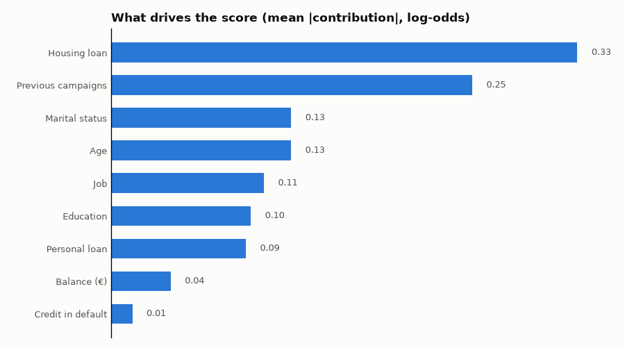
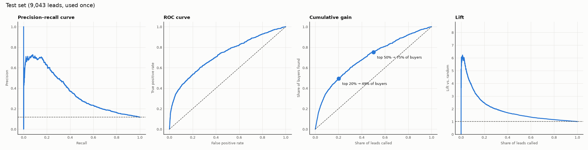
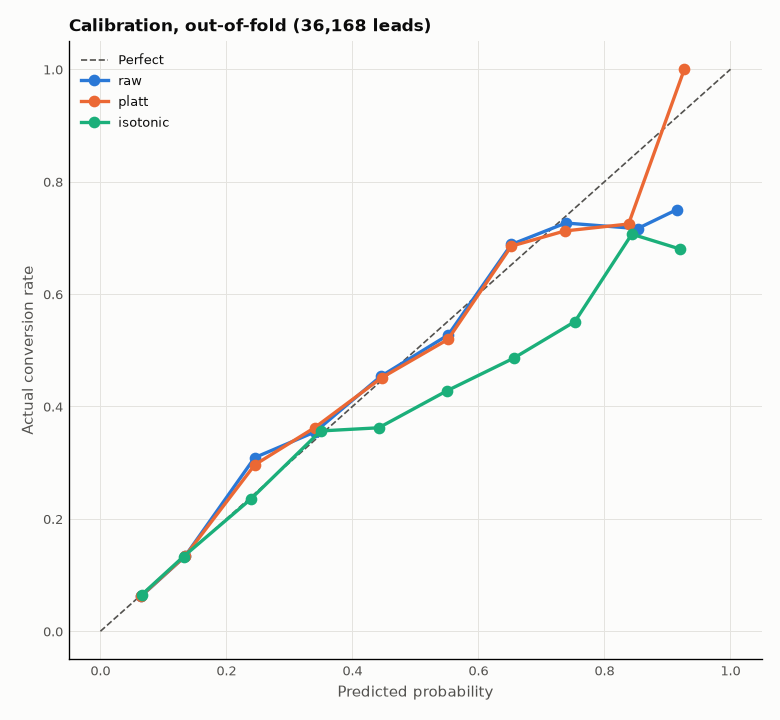

# Bank Marketing: the second dataset

> Phase 6. Goal: run the same Apex pipeline on a very different dataset, to show what is general, and to check that the leakage audit catches `duration` by itself.
> Settings: [`config_bank.json`](../config_bank.json). Every command takes it through `APEX_CONFIG`:

```bash
APEX_CONFIG=config_bank.json make data-download   # UCI zip → data/raw/bank-full.csv
APEX_CONFIG=config_bank.json make data-info       # shape, SHA-256, conversion rate
```

The bank config has its own paths (`models/bank/`, `reports/figures/bank/`, `data/splits_bank.csv`, `data/apex_bank.db`), so it never overwrites the lead model.

## Summary

**The Apex pipeline works on a second, very different dataset with configuration only:** 45,211 bank clients, 11.7% subscribed (the leads: 9,240, 38.5%). No cleaning, modelling, evaluation, or segmentation code was written for the bank; the general parts that were lead-specific (download source, file format, feature and explanation definitions) were turned into config.

| Finding | Evidence |
|---|---|
| **The leakage audit catches `duration` by itself** | Biggest gain in the with/without check: +0.155 / +0.167 PR-AUC (section 4), as `Tags` was for the leads (+0.148) |
| **The model ranks clients well** | Test PR-AUC **0.359** vs. 0.117 random (3.1×); the top 20% hold **49%** of subscribers, and 29% of those calls succeed (random: 11.7%) |
| **The same design decisions hold** | Logistic Regression, `C = 1`, no class weights (`balanced` doubles the Brier score), raw probabilities (ECE 0.009), capacity-based segments (High 28.6% vs. Low 5.8%) |
| **Ranking carries over in time; probabilities do not** | Trained on older clients, tested on newer ones: ROC-AUC 0.726 → 0.707, but conversion jumps 6.7% → 31.6% and calibration error 0.009 → 0.163. Retrain regularly; the outcomes check catches this |
| **New useful feature block** | `age_group` (U-shaped age effect): CV PR-AUC 0.344 → 0.356 |

**Scope:** pipeline and report. The bank model is saved in `models/bank/` but has no API, demo, monitoring, or model card of its own (`card.py` describes the lead product).

| Step | Section |
|---|---|
| B.1 Data collection & quality | 1–3 |
| B.2 Leakage audit | 4 |
| B.3 Features | 5 |
| B.4 Model, evaluation, segments, time split | 6 |
| B.5 Comparison with the lead model | 7 |

---

## 1. Source

| Field | Value |
|---|---|
| Dataset | *Bank Marketing*, UCI Machine Learning Repository, id 222 (Moro et al., 2011) |
| URL | https://archive.ics.uci.edu/static/public/222/bank+marketing.zip |
| License | CC BY 4.0 (UCI) |
| What it is | Phone marketing campaigns of a Portuguese bank (May 2008 – Nov 2010) to sell a **term deposit** |
| File used | `bank-full.csv` (inside `bank.zip` inside the download) → `data/raw/bank-full.csv`; column descriptions: `bank-names.txt` |
| Not used | `bank-additional-full.csv` (adds 5 economic indicators; more columns, same idea) |
| Downloaded on | 2026-10-06, with `make data-download` |
| SHA-256 (`bank-full.csv`) | `d1513ec63b385506f7cfce9f2c5caa9fe99e7ba4e8c3fa264b3aaf0f849ed32d` |
| Size | 4.61 MB |
| Rows × columns | **45,211 × 17** (+ `row_id` added by the loader) |
| Target | `y`: did the client subscribe? `"yes"` → 1, `"no"` → 0 |
| Conversion rate | **11.7%** (5,289 yes · 39,922 no): much more imbalanced than the leads (38.5%) |

**Unit and prediction moment.** One row = one client contacted in a campaign. The model should score a client **before the call**, so the bank knows whom to call first. (Same idea as for leads: before any sales contact in this campaign.)

### What the loader does differently (all from config)

| Difference | Config | Effect |
|---|---|---|
| Separator `;` | `data.csv_sep` | read correctly |
| Target `"yes"` / `"no"` | `data.target_values` | mapped to 1 / 0; any other value is an error |
| No id column | `data.id_columns = ["row_id"]` | `row_id` = row number 1…45,211, stable as long as the file hash is the same (needed for the saved split) |
| Zip inside a zip | `source.url`, `source.files` | the downloader searches nested zips |

## 2. Columns

From `bank-names.txt`. Conversion rate per value is on all 45,211 rows (11.7% overall).

| Column | Type | Meaning | Notes |
|---|---|---|---|
| `age` | int | Age | ≤ 25: **24%**, 60+: **42%**, 35–60: ~10% |
| `job` | text (12) | Job type | retired 22.8%, management 13.8%, blue-collar 7.3%; `unknown` 0.6% |
| `marital` | text (3) | Marital status | single 14.9%, married 10.1% |
| `education` | text (3) | Education | tertiary 15.0%, primary 8.6%; `unknown` 4.1% |
| `default` | yes/no | Has credit in default | yes 6.4% vs. no 11.8%; only 1.8% "yes" |
| `balance` | int (€) | Average yearly balance | **negative for 8.3%** (overdraft: valid); max 102,127 |
| `housing` | yes/no | Has a housing loan | yes 7.7% vs. no 16.7% |
| `loan` | yes/no | Has a personal loan | yes 6.7% vs. no 12.7% |
| `contact` | text (2) | Contact type of the **last contact** | cellular 14.9%, telephone 13.4%, `unknown` **28.8%** (4.1%) |
| `day`, `month` | int / text | Day and month of the **last contact** | May has 30% of calls but converts at 6.7%; April 19.7% |
| `duration` | int (s) | Length of the **last call** | ⚠️ known only **after** the call; 0 s → always "no" (B.2) |
| `campaign` | int | Contacts in this campaign, **including the last one** | median 2, max 63 |
| `pdays` | int | Days since the last contact in a previous campaign; **−1 = never contacted** | −1 for 81.7% |
| `previous` | int | Contacts before this campaign | median 0, max 275 |
| `poutcome` | text (3) | Result of the previous campaign | success **64.7%**, failure 12.6%; `unknown` 81.7% |
| `y` | target | Subscribed a term deposit | 11.7% |

Several columns describe the **last contact** of this campaign (`contact`, `day`, `month`, `duration`, `campaign`). Which of them are known before the call is the question of step B.2.

## 3. Data quality and cleaning

The **same `clean()` as for the leads** runs on this data; only `config_bank.json` differs. No code was written for this dataset's cleaning.

| # | Issue | Size | Decision | Config |
|---|---|---|---|---|
| 1 | `"unknown"` = hidden missing value | job 0.6%, education 4.1%, contact 28.8%, poutcome 81.7% | → missing, then `"Missing"` category (kept: e.g. contact unknown converts at 4.1%) | `missing_placeholders` |
| 2 | `poutcome = "unknown"` is **not** really missing | 36,954 of its 36,959 rows have `pdays = −1` | It means "no previous campaign"; kept as the `"Missing"` category, which the model learns as that | — |
| 3 | `pdays = −1` as "never" | 81.7% | Valid sentinel; not checked as negative; turned into a clear feature in B.3 | not in `numeric_columns` |
| 4 | Negative `balance` | 3,766 rows (8.3%) | Valid (overdraft); not checked as negative | not in `numeric_columns` |
| 5 | Yes/No columns in lower case | `default`, `housing`, `loan` | → 1 / 0 (encoding now ignores letter case) | `binary_columns` |
| 6 | Outliers | `balance` max 102,127; `campaign` max 63; `previous` max 275 | Cap near the 99.9th percentile: balance 35,000 (41 rows), campaign 30 (59), previous 25 (28). Rows are kept | `caps` |
| 7 | Duplicates | 0 identical rows | Nothing to do | — |
| 8 | Missing values (`NaN`) | none in the file | — | — |
| 9 | Imbalance | 11.7% positive | PR-AUC baseline is 0.117; class weights get tested again in B.4 | — |

**Result:** `clean(load_raw())` → 45,211 rows × 17 columns, 0 missing values, no rows removed.

## 4. Leakage audit (B.2)

**The test for every column:** *does the bank know this before it calls the client in this campaign?* Suspects are listed in `config_bank.json → data.leakage_suspects`; the check is the same code as for the leads:

```bash
APEX_CONFIG=config_bank.json make leakage
```

A quick Logistic Regression (5-fold CV, PR-AUC) is scored on the cleaned data without any suspect, then with each group added. Random guessing scores 0.117.

The file is **sorted by date** (May 2008 → Nov 2010), and conversion changes a lot over time (3% in the oldest tenth of the rows, 47% in the newest). So the check is run twice: with folds in file order (each fold ≈ a time period) and with shuffled folds.

| Group | Known before the call? | Gain, time-ordered folds | Gain, shuffled folds | Decision |
|---|---|---|---|---|
| — base (no suspects) | — | PR-AUC 0.340 | PR-AUC 0.347 | — |
| `duration` | ❌ length of the last call: only known **after** it; a 0-second call is always "no" | **+0.155** | **+0.167** | ❌ **Leakage** |
| `campaign` | ❌ calls in this campaign, **including** the one being predicted | −0.002 | +0.007 | ❌ Remove (not known before; adds nothing) |
| `day`, `month` | ❌ date of the last call; mostly encodes the 2008–2010 calendar | **−0.199** | +0.039 | ❌ Remove (not known before; does not carry over to another period) |
| `contact` | ⚠️ cellular / telephone is on file, but `unknown` marks the **first months** of data collection (100% of the oldest 20% of rows, ~0% later) | +0.097 | +0.011 | ❌ Remove to be safe: its gain comes from the time period, not the client |

**Result: the audit catches `duration` by itself.** It is the biggest gain in both checks (about +45% PR-AUC), just as `Tags` was for the leads (+0.148). The publishers say the same in the notes of the dataset's other version (`bank-additional-names.txt`): "the duration is not known before a call is performed … this input should only be included for benchmark purposes and should be discarded if the intention is to have a realistic predictive model."

**Removed:** `duration`, `campaign`, `day`, `month`, `contact` (`config_bank.json → data.leakage_columns`).

**Kept:** what the bank knows before calling:
- client profile: `age`, `job`, `marital`, `education`, `default`, `balance`, `housing`, `loan`
- history with earlier campaigns: `pdays`, `previous`, `poutcome`

These give PR-AUC **0.34**, about **3× random** (0.117), before any feature work or tuning. The cleaned data: 45,211 rows × 11 features + target.

### Finding for B.4: time matters

Conversion grows from 3% to 47% across the file, so a **random split** mixes old and new clients, while a **time split** (train on older, test on newer) is closer to real use. B.4 reports both.

## 5. Features (B.3)

```bash
APEX_CONFIG=config_bank.json make features   # 45,211 rows: 17 raw columns → 34 model inputs
APEX_CONFIG=config_bank.json make explain    # what drives the score, example reasons
```

**No bank-specific code.** `add_features()` was made config-driven with small building blocks (`config → features`): `presence_only`, `ratios`, `flags`, `bins`, `drop`. The lead features (`time_per_visit`, `has_web_activity`) are now config too, and the lead model gives exactly the same results (test PR-AUC 0.7874). The same goes for explanations: readable names and grouped reasons come from `config → explain`.

**Ideas tested** (5-fold CV on the bank train split, 27,126 clients; Logistic Regression; ± is the fold-to-fold spread):

| Variant | CV PR-AUC | Recall top 20% | Decision |
|---|---|---|---|
| Base: the 11 kept columns | 0.3435 ± 0.018 | 47.0% | — |
| + `previously_contacted` (pdays > −1) | 0.3432 ± 0.018 | 47.0% | ❌ adds nothing: `poutcome = Missing` already means "never contacted" |
| + `age_group` (≤ 25, 25–35, 35–45, 45–60, > 60) | 0.3560 ± 0.015 | 48.5% | ✅ age is U-shaped (≤ 25: 24%, 35–60: ~10%, > 60: 42%), which a straight line can't follow |
| `age_group` **instead of** `age` | **0.3562 ± 0.015** | **48.5%** | ✅ **chosen**: same score, one column fewer |
| + `balance` bands (0, 500, 2,000, 10,000) | 0.3589 ± 0.015 | 49.2% | ❌ +0.003, well inside the noise; simpler wins |

**Final features** (`config_bank.json → features`): `age` → `age_group`; everything else as cleaned: `job`, `marital`, `education`, `default`, `balance`, `housing`, `loan`, `pdays`, `previous`, `poutcome`. One-hot encoding and scaling as for the leads.

**What drives the score** (validation split, model fitted on train):



| Field | Mean \|contribution\| | Direction |
|---|---|---|
| Housing loan | 0.33 | has one → less likely (7.7% vs. 16.7%) |
| Previous campaigns (`pdays`, `previous`, `poutcome` as one reason) | 0.25 | a previous **success** → much more likely (64.7%) |
| Marital status | 0.13 | single → more likely |
| Age | 0.13 | ≤ 25 and > 60 → more likely |
| Job, education, personal loan | 0.09–0.11 | retired / students, tertiary education → more likely; personal loan → less |
| Balance, credit in default | ≤ 0.04 | small |

Example reasons (`explain_one`), as a bank agent would see them:

| Score | Reasons up | Reasons down |
|---|---|---|
| 0.912 | Previous campaigns = pdays 97, previous 1, poutcome success · Age = ≤ 25 · Balance (€) = 23878 | Education = secondary |
| 0.014 | — | Credit in default = yes · Job = housemaid · Personal loan = yes |

## 6. Model and results (B.4)

The **same commands** as for the leads, with the bank config. The bank has its own MLflow experiment (`apex-bank-marketing`) and saves its model to `models/bank/`.

```bash
export APEX_CONFIG=config_bank.json
make split baselines tune   # 60 / 20 / 20 split (11.7% in each), baselines, grid search
make evaluate               # test set, used once
make calibration segments time-split train
```

### Baselines and tuning

Validation split (9,042 clients):

| Model | PR-AUC | ROC-AUC | Top 20%: precision / recall |
|---|---|---|---|
| Random calling (no skill) | 0.117 | 0.500 | 11.7% / 20% |
| Logistic Regression | **0.376** | 0.731 | **29.8% / 51.0%** (lift 2.55) |

Grid search (`make tune`, 5-fold CV on train): the same result as for the leads ([ADR-004](decisions.md)).
- `C` from 0.03 to 10: PR-AUC 0.356–0.357, all within the noise (± 0.015). `C = 1` stays.
- `balanced` class weights: same ranking (0.355), but the **Brier score doubles** (0.090 → 0.199). With 11.7% positives, balancing pushes every probability far too high. No class weights.

### Test set (used once)

Fitted on train + validation (36,168), scored on the test split (9,043):

| Metric | Random calling | **Test** |
|---|---|---|
| PR-AUC | 0.117 | **0.359** (CV 0.356, validation 0.376) |
| ROC-AUC | 0.500 | 0.726 |
| Brier | 0.103 | 0.089 |
| Calibration error (ECE) | — | **0.009** |
| Top 20%: precision / recall | 11.7% / 20% | **28.9% / 49.4%** (lift 2.47) |
| Top 50%: precision / recall | 11.7% / 50% | 17.6% / 75.1% |



### Calibration

Out-of-fold on train + validation (36,168 clients):

| Probabilities | ECE | Brier | PR-AUC |
|---|---|---|---|
| **Raw (kept)** | **0.005** | 0.0895 | 0.360 |
| Platt | 0.005 | 0.0895 | 0.360 |
| Isotonic | 0.009 | 0.0910 | 0.353 |

The raw probabilities are already very well calibrated (a predicted 13% → 13.3% actual; 45% → 45%), better than isotonic, so no extra step ([ADR-005](decisions.md) holds here too). The only weak spot is the rare top group: predicted 0.85 → 72% actual (194 clients).



### Segments (capacity: top 20% / next 30% / rest)

Thresholds from out-of-fold scores: High ≥ **0.137**, Medium ≥ **0.085** (much lower than for leads, because only 11.7% subscribe).

| Segment (test, 9,043) | Clients | Subscribe | Share of all subscriptions |
|---|---|---|---|
| 🟢 High | 1,833 (20%) | **28.6%** | **49.6%** |
| 🟡 Medium | 2,782 (31%) | 9.9% | 26.1% |
| 🔴 Low | 4,428 (49%) | 5.8% | 24.3% |

High subscribes **4.9×** more often than Low. Calling the top half reaches 76% of subscribers.

### Time split: does the model age well?

The file is in date order, so `make time-split` trains on the **oldest 80%** of clients and tests on the **newest 20%**:

| | Random split | **Time split** |
|---|---|---|
| Conversion in training / test | 11.7% / 11.7% | **6.7% / 31.6%** |
| PR-AUC (vs. random calling) | 0.359 vs. 0.117 → **3.1×** | 0.522 vs. 0.316 → **1.7×** |
| ROC-AUC | 0.726 | 0.707 |
| Top 20%: precision / recall | 28.9% / 49.4% | 56.4% / 35.7% |
| Calibration error (ECE) | 0.009 | **0.163** |

- **The ranking carries over to a new period:** ROC-AUC drops only slightly (0.726 → 0.707), so the model still puts better clients first, and the High / Medium / Low segments (which use rank) still work.
- **The probabilities do not:** the model learned that ~7% subscribe; in the newest period 32% did. Every probability is far too low.
- In production, this is what the **outcomes check** catches (real results vs. expected) and the reason to retrain regularly. The random-split numbers above are therefore optimistic for a model used months after training.

### Final model

`make train` fits the final model on all 45,211 clients → `models/bank/model.pkl`, `model_meta.json`, `reference_profile.json` (out-of-fold PR-AUC 0.360). No model card: `card.py` describes the lead product (`config_bank.json → project.model_card = false`).

## 7. Leads vs. Bank Marketing

| | Leads (X Education) | Bank Marketing (UCI) |
|---|---|---|
| Rows · conversion | 9,240 · 38.5% | 45,211 · **11.7%** |
| Leakage caught | `Tags` (+0.148 PR-AUC) and 8 more columns | `duration` (+0.16) and 4 more columns |
| Raw fields used · model inputs | 7 · 24 | 11 · 34 |
| Test PR-AUC (vs. random) | 0.787 (2.0×) | 0.359 (**3.1×**) |
| Test ROC-AUC | 0.855 | 0.726 |
| Top 20%: precision · recall | 83.2% · 43.3% | 28.9% · 49.4% |
| Calibration error (ECE) | 0.031 (out-of-fold) | 0.005 (out-of-fold) |
| High vs. Low conversion | 84.1% vs. 11.8% (7.1×) | 28.6% vs. 5.8% (4.9×) |
| Settings | `C = 1`, no class weights, raw probabilities | the same |
| Time check | not possible (no dates) | ranking holds, probabilities drift |

**What was general from the start:** cleaning (`clean()`), the leakage check, the split, the model and its settings, CV and tuning, evaluation and calibration, capacity-based segments, the explanation method.

**What had to become configuration:** the download source (Kaggle or a URL, zips inside zips), the file format (separator, target labels, a missing id column), the leakage suspects, feature building blocks (`ratios`, `flags`, `bins`, …), explanation names and groups, the MLflow experiment, and whether a model card is written ([ADR-009](decisions.md)).

**What still needs a person:** deciding what is known at the prediction moment (the leakage audit), and choosing features. The pipeline measures; a person decides.

