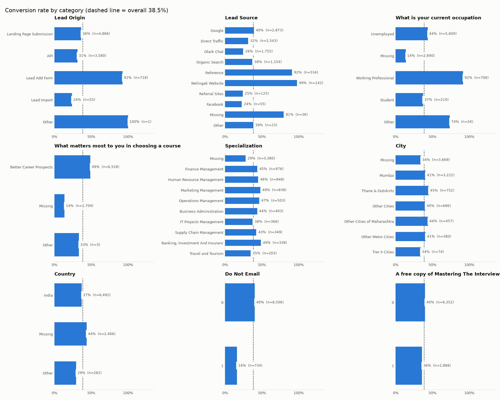
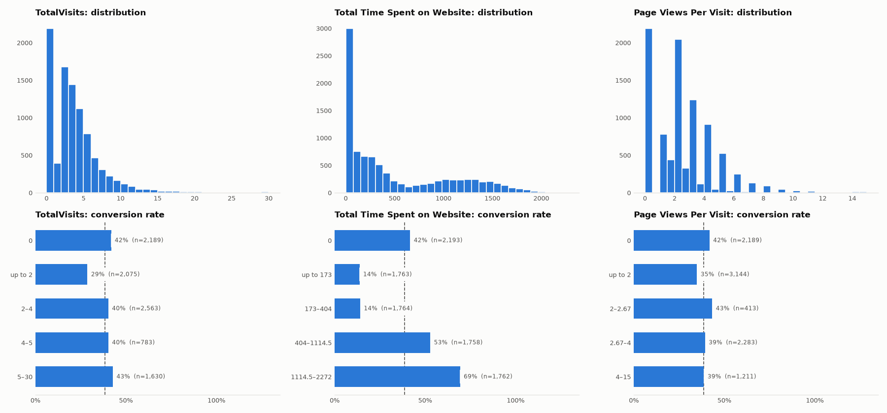

# EDA Report

> Stage 3, part 2 (step 1.5). Data: `clean(load_raw())`, 9,240 leads × 12 features, conversion rate **38.5%**.
> Reproduce with `make eda` ([`src/apex/data/eda.py`](../src/apex/data/eda.py)); figures go to `reports/figures/eda_*.png`.

The goal of this step: find which features carry signal, which are redundant, and what new features are worth building in step 2.1.

---

## Key findings

| # | Finding | Evidence |
|---|---|---|
| 1 | **Time on site is the strongest numeric signal** | **14%** conversion for 1–404 s on the site vs. **69%** above 1,115 s |
| 2 | **Visit and page-view counts carry almost no signal** | 29%–43% across all bins; Spearman with target 0.04 and 0.00 |
| 3 | **Lead Add Form leads almost always convert** | `Lead Origin = Lead Add Form`: **92.5%** (718 leads) |
| 4 | **Occupation is strong, and "missing" is the weakest group** | Working Professional **92%**, Unemployed 44%, Missing **14%** |
| 5 | **Opting out of emails halves the chance** | `Do Not Email = 1`: 16% vs. 40% |
| 6 | **City, Country, the free-book flag, and specialization type add little** | All values within ~10 points of 38.5%; specialization: only *missing vs. present* matters (29% vs. 35–49%) |
| 7 | **Two pairs of columns repeat each other** | See redundancy below |

---

## 1. Numeric features

| Column | Shape | Conversion pattern |
|---|---|---|
| `Total Time Spent on Website` | 24% zeros, long right tail, second hump around 1,000–1,500 s | **Clear step:** 0 → 42%, up to 404 s → 14%, 404–1,115 → 53%, > 1,115 → 69% |
| `TotalVisits` | 24% zeros, most leads 1–6 visits | Flat: 29% (1–2 visits) to 43% (> 5) |
| `Page Views Per Visit` | 24% zeros, peaks at whole numbers | Flat: 35%–43% |

**Zeros are a mix of two very different groups.** Leads with no web activity convert at 42% overall, but that is an average of API leads (**24%**, 1,602 leads) and Lead Add Form leads (**93%**, 557 leads). The zero is not itself a signal; the origin is.

## 2. Categorical features

| Column | Highest | Lowest | Signal |
|---|---|---|---|
| `Lead Origin` | Lead Add Form **92%** | Lead Import 24% | Strong |
| `Lead Source` | Welingak Website **99%**, Reference **92%** | Facebook 24%, Referral Sites 25%, Olark Chat 26% | Strong |
| `What is your current occupation` | Working Professional **92%** | Missing **14%** | Strong |
| `What matters most…` | Better Career Prospects 49% | Missing **14%** | Strong, but see redundancy |
| `Do Not Email` | 0 → 40% | 1 → **16%** | Medium |
| `Specialization` | Banking / Marketing 49% | Missing 29% | Weak (missing vs. present) |
| `Country` | Missing 44% | Other 29% | Weak |
| `City` | Thane & Outskirts 45% | Missing / Tier II 34% | Weak |
| `A free copy of Mastering The Interview` | 0 → 40% | 1 → 36% | Very weak |

## 3. Correlations and redundant features

**Numeric (Spearman):**

| | TotalVisits | Time on site | Page views / visit | Converted |
|---|---|---|---|---|
| TotalVisits | 1 | 0.58 | **0.85** | 0.04 |
| Time on site | 0.58 | 1 | 0.56 | **0.26** |
| Page views / visit | **0.85** | 0.56 | 1 | 0.00 |

**Categorical (Cramér's V, 0 = unrelated, 1 = same information):** strongest pairs are `Lead Origin`–`Lead Source` **0.78**, `Lead Source`–`Country` 0.68, occupation–"what matters most" **0.57**. All other pairs are ≤ 0.49.

Redundant pairs:
- **`What matters most…` repeats occupation's missingness.** It is missing for 2,709 leads, and 2,690 of them (99.3%) also have no occupation. When present it is "Better Career Prospects" in 6,528 of 6,531 cases. So the column says only "the lead skipped this part of the form", which occupation already says.
- **`Lead Source` = Reference / Welingak Website / Missing ⇔ `Lead Origin` = Lead Add Form.** 709 of the 718 Lead Add Form leads come from these sources. The two columns overlap on the strongest signal in the data.
- **`TotalVisits` and `Page Views Per Visit`** move together (0.85), and neither predicts conversion on its own.

## 4. Risk check

- **Lead Add Form (92.5%)** stays the main leakage risk from step 1.4: if sales adds these leads after a good call, the model learns "sales already liked them". It is kept because origin is known when the lead is created, but it must be watched in SHAP (step 3.4). If one feature dominates the model, the leakage alarm in [problem_framing.md](problem_framing.md) 5.3 applies.
- **Time on site** may include visits after first contact (step 1.4 risk). Its pattern (14% → 69%) is strong but smooth, not a near-perfect split, so it looks like real engagement rather than a leak.

---

## Feature ideas for step 2.1

| Idea | Type | Why | Priority |
|---|---|---|---|
| `time_per_visit` = time on site ÷ visits (0 when no visits) | New feature | Visits are flat, time is strong; time per visit separates long, focused visits from quick ones | High |
| `has_web_activity` = visits > 0 | New feature | Splits API/Lead Add Form leads from website leads | Medium |
| Drop `What matters most…` | Selection | Duplicate of occupation missingness (section 3) | High |
| Drop `Page Views Per Visit` | Selection | 0.85 with visits, no signal on its own | Medium; confirm in step 2.4 |
| `Specialization` → present / missing | Simplify | Only presence matters; 18 values add noise | Medium |
| Group rare `Lead Source` values into `Other` | Grouping | Values with < 1% of leads (`bing`, `Click2call`, …); fitted on training data only | High |
| Test dropping `City`, `Country`, free-book flag | Selection | Weak signal; check PR-AUC with and without in step 2.4 | Low |

Every selection idea is tested in steps 2.3–2.4 (PR-AUC with and without) before it is accepted.
