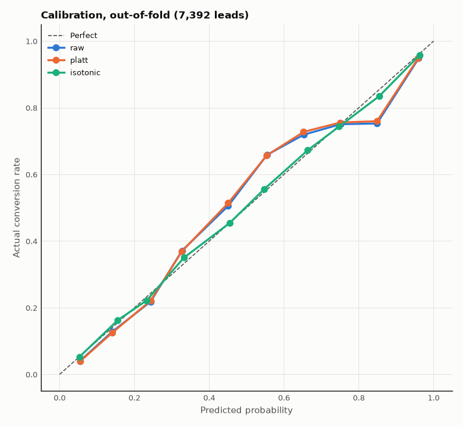

# Models

> Stages 7+ (from step 2.3). Code: [`src/apex/models/`](../src/apex/models/). Runs are tracked in MLflow (`make mlflow-ui` → http://localhost:5000, experiment `apex-lead-scoring`).

**Model:** Logistic Regression on the feature pipeline from [features.md](features.md) ([ADR-003](decisions.md)).

---

## Metrics

From [problem_framing.md](problem_framing.md) section 5, in [`evaluate.py`](../src/apex/models/evaluate.py):

| Metric | Meaning | No-skill value |
|---|---|---|
| **PR-AUC** (primary) | How well buyers are ranked above non-buyers, focused on the buyers | = conversion rate (0.385) |
| ROC-AUC | Ranking quality overall | 0.5 |
| Brier | Mean squared error of the probabilities (lower is better) | p(1 − p) ≈ 0.237 |
| **Precision top 20%** | Of the leads called (the 20% highest-scored, the **High** segment), the share who buy | = conversion rate (38.5%) |
| **Recall top 20%** | Of **all** buyers, the share found in the top 20% | 20% |
| Lift top 20% | Recall ÷ 20%: how many times better than calling at random | 1.0 |
| Precision / recall / lift top 50% | Same for High + Medium | 38.5% / 50% / 1.0 |
| Precision / recall at 0.5 | Same, but "called" = probability ≥ 0.5 (standard classifier view) | — |

**Why top k%, not only 0.5?** The sales team calls leads from the top of the list until it runs out of time, so the cut-off is a share of leads, not a probability. The 0.5 view is shown for comparison.

## Step 2.3: Baselines

```bash
make split       # once, if data/splits.csv does not exist
make baselines   # fit on train (5,544), score on validation (1,848), log to MLflow
```

**Ranking quality**

| Model | PR-AUC | ROC-AUC | Brier |
|---|---|---|---|
| No skill (predicts 38.5% for everyone) | 0.385 | 0.500 | 0.237 |
| **Logistic Regression** (default settings) | **0.840** | **0.887** | **0.130** |

**Precision and recall**

| Model | Cut-off | Leads called | Precision | Recall | Lift |
|---|---|---|---|---|---|
| No skill | top 20% | 370 | 36.8% | 19.1% | 0.96 |
| No skill | top 50% | 924 | 40.2% | 52.1% | 1.04 |
| **Logistic Regression** | **top 20%** | 370 | **88.9%** | **46.2%** | **2.31** |
| **Logistic Regression** | **top 50%** | 924 | **67.3%** | **87.4%** | **1.75** |
| **Logistic Regression** | probability ≥ 0.5 | 617 | 81.2% | 70.4% | — |

How to read it for Logistic Regression:
- **Top 20%:** about **9 in 10 calls reach a buyer** (vs. fewer than 4 in 10 at random), and these calls find **46% of all buyers**.
- **Top 50%:** 2 in 3 calls reach a buyer, and they find **87% of all buyers**.
- **Probability ≥ 0.5:** 81% of the flagged leads buy, and they are 70% of all buyers. The cut-off changes the trade-off: call fewer leads → higher precision, lower recall.

Against the targets in [problem_framing.md](problem_framing.md):

| Target | Required | Logistic Regression | |
|---|---|---|---|
| Recall in top 20% | ≥ 40% (ceiling ≈ 52%) | 46.2% | ✅ |
| Recall in top 50% | ≥ 80% | 87.4% | ✅ |
| PR-AUC | far above no skill (0.385) | 0.840 | ✅ |
| Brier | below no skill (0.237) | 0.130 | ✅ |
| Leakage alarm | ROC-AUC < 0.95 | 0.887 | ✅ no alarm |

The top 20% can hold at most 20 / 38.5 ≈ 52% of buyers, so 46.2% is about 89% of the best possible result.

The no-skill scores are all equal, so its ranking is arbitrary; its precision and recall values are what random calling gives, up to noise.

**These numbers are the bar to beat.** The test set is untouched; its single use is step 3.1.

## Step 2.4: Cross-validation and feature selection

One validation score moves by about ±0.01 PR-AUC depending on which leads land in it, so choices are made on **5-fold stratified CV of the train split** (mean ± std), and the validation split confirms them.

```bash
make cv   # all features vs. selected features, logged to MLflow
```

Each feature idea from [eda.md](eda.md), tested alone (CV PR-AUC; all features = 0.8176 ± 0.011):

| Change | CV PR-AUC | Effect |
|---|---|---|
| Drop `Page Views Per Visit` | 0.8171 | −0.0005 (noise) |
| Drop `City` | 0.8173 | −0.0003 (noise) |
| Drop `Country` | 0.8172 | −0.0004 (noise) |
| Drop free-book flag | 0.8177 | +0.0001 (noise) |
| `Specialization` → Given / Missing | 0.8186 | +0.0010 (noise) |
| Drop `Specialization` entirely | 0.8165 | −0.0011: kept as Given / Missing instead |

**Rule:** when a simpler version scores the same (difference well inside ± 0.011), the simpler version wins. All five simplifications together:

| Features | Count | CV PR-AUC | CV ROC-AUC | CV Brier | CV precision top 20% | CV recall top 20% |
|---|---|---|---|---|---|---|
| All | 51 | 0.8176 ± 0.0108 | 0.8679 | 0.1402 | 86.3% | 44.8% |
| **Selected** | **24** | **0.8176 ± 0.0109** | **0.8691** | **0.1404** | **85.7%** | **44.5%** |

Same quality with half the features, and the API needs 4 fewer input fields. Details: [features.md](features.md).

**Validation with the selected features** (`make baselines`):

| Model | PR-AUC | ROC-AUC | Brier | Precision top 20% | Recall top 20% | Recall top 50% |
|---|---|---|---|---|---|---|
| Logistic Regression, all features (step 2.3) | 0.840 | 0.887 | 0.130 | 88.9% | 46.2% | 87.4% |
| **Logistic Regression, selected features** | **0.839** | **0.887** | **0.130** | **88.7%** | **46.1%** | **87.4%** |

## Step 2.5: Tuning

```bash
make tune   # 7 values of C × 2 class weights = 14 setups, 5-fold CV each, logged to MLflow
```

Logistic Regression has two settings that matter:
- **`C`**, the regularization strength. Small `C` pushes weights toward zero (simpler, but can underfit); large `C` lets the model follow the data more closely.
- **`class_weight`**: `none` treats every lead the same; `balanced` gives buyers more weight because they are the smaller class (38.5%).

CV on the train split (best first; ± is PR-AUC std over 5 folds):

| C | class_weight | PR-AUC | ROC-AUC | Brier | Precision top 20% | Recall top 20% |
|---|---|---|---|---|---|---|
| 3 | none | 0.8177 ± 0.010 | 0.8689 | 0.1404 | 85.6% | 44.5% |
| **1** | **none** | **0.8176 ± 0.011** | **0.8691** | **0.1404** | **85.7%** | **44.5%** |
| 10 | none | 0.8175 ± 0.010 | 0.8688 | 0.1404 | 85.7% | 44.5% |
| 1 | balanced | 0.8171 ± 0.011 | 0.8690 | 0.1444 | 85.8% | 44.6% |
| 0.3 | none | 0.8165 ± 0.011 | 0.8687 | 0.1405 | 85.8% | 44.6% |
| 0.1 | none | 0.8139 ± 0.012 | 0.8679 | 0.1411 | 85.2% | 44.3% |
| 0.03 | none | 0.8054 ± 0.014 | 0.8655 | 0.1440 | 84.9% | 44.1% |
| 0.01 | none | 0.7889 ± 0.019 | 0.8598 | 0.1509 | 83.3% | 43.3% |

(Other `balanced` rows follow the same pattern; full table in MLflow.)

What it shows:
- **`C` ≥ 0.3 is a plateau.** 0.3, 1, 3 and 10 are all within 0.001, far inside the ± 0.011 noise. Only strong regularization (`C` ≤ 0.1) hurts.
- **`balanced` does not improve the ranking** (PR-AUC 0.8171 vs. 0.8176) but **makes the probabilities worse** (Brier 0.144 vs. 0.140): it inflates every score.

**Validation check** (train → validation):

| Settings | PR-AUC | Brier | Mean predicted probability | Precision / recall at 0.5 | Recall top 20% |
|---|---|---|---|---|---|
| **C = 1, none** | **0.839** | **0.130** | **0.393** (actual rate 0.385) | 80.8% / 70.4% | 46.1% |
| C = 1, balanced | 0.839 | 0.136 | 0.461 | 76.7% / 76.8% | 45.9% |

**Choice: `C = 1`, no class weights** (`config.json → model`, [ADR-004](decisions.md)). It ties for the best ranking, and its probabilities stay honest: on average it predicts 39.3% for a group that converts at 38.5%. The default settings were already the best, so the tuned model equals the step 2.4 model: **validation PR-AUC 0.839, 88.7% precision and 46.1% recall in the top 20%**.

## Step 3.1: Final test evaluation

```bash
make evaluate   # retrain on train + validation (7,392 leads), score the test set (1,848 leads) once
```

The final model (`C = 1`, no class weights, 24 features) is refitted on train + validation, then scores the test split. **This is the only time the test split is used**; nothing is changed after seeing it.

| Metric | No skill | CV (train) | Validation | **Test** |
|---|---|---|---|---|
| PR-AUC | 0.385 | 0.818 ± 0.011 | 0.839 | **0.787** |
| ROC-AUC | 0.500 | 0.869 | 0.887 | **0.855** |
| Brier | 0.237 | 0.140 | 0.130 | **0.149** |
| Precision top 20% | 38.5% | 85.7% | 88.7% | **83.2%** |
| Recall top 20% | 20% | 44.5% | 46.1% | **43.3%** |
| Lift top 20% | 1.0 | 2.22 | 2.30 | **2.16** |
| Precision top 50% | 38.5% | — | 67.3% | **65.8%** |
| Recall top 50% | 50% | — | 87.4% | **85.4%** |
| Precision / recall at 0.5 | — | 80.3% / 67.2% | 80.8% / 70.4% | **76.7% / 65.2%** |

**Targets** ([problem_framing.md](problem_framing.md) section 5): recall top 20% ≥ 40% ✅ (43.3%), recall top 50% ≥ 80% ✅ (85.4%), Brier below no skill ✅, no leakage alarm (ROC-AUC < 0.95) ✅.


### Why the test score is lower

Test PR-AUC (0.787) is below validation (0.839) and the CV average (0.818). Checks made **after** the test run, without changing the model:

| Check | Result |
|---|---|
| 95% bootstrap interval (1,000 resamples) | Test **0.756–0.816**, validation 0.815–0.864: the CV average sits where they meet |
| Lead mix | Same in all splits: Landing Page 52–54%, API 38–39%, Lead Add Form 7.6–8.1%; occupation missing 29–30% |
| Where the gap is | Mostly Landing Page Submission leads: PR-AUC 0.737 on test vs. 0.811 on validation |

Conclusion: validation was a slightly easy sample and test a slightly hard one. The best estimate for new leads is **PR-AUC ≈ 0.80 ± 0.03**, with the top 20% finding about 43–46% of buyers. The test numbers above are the ones reported.

## Step 3.2: Probability calibration

A score is shown to sales reps as a probability, so **a predicted 0.70 should mean about 70% of such leads convert**. Target ([problem_framing.md](problem_framing.md) 5.2): expected calibration error (ECE) ≤ 0.05.

```bash
make calibration   # out-of-fold check on train + validation, figure in reports/figures/
```

**How it is checked without the test split:** every lead in train + validation (7,392) is scored by a model trained on the other 4/5 of the data (5-fold out-of-fold predictions). Leads are grouped by predicted probability (0–0.1, 0.1–0.2, …), and each group's average prediction is compared with its actual conversion rate.

**ECE** = the average gap between predicted and actual, weighted by the number of leads in each group. 0 is perfect.

| Probabilities | ECE | Brier | PR-AUC | Mean prediction (actual 0.385) |
|---|---|---|---|---|
| **Raw Logistic Regression** | **0.031** ✅ | **0.1377** | **0.824** | **0.386** |
| Platt scaling | 0.032 | 0.1378 | 0.824 | 0.385 |
| Isotonic regression | 0.006 | 0.1362 | 0.821 | 0.385 |

Raw model, per group:

| Predicted | Leads | Mean predicted | Actually converted | Gap |
|---|---|---|---|---|
| 0.0–0.1 | 1,235 | 5.5% | 4.0% | −1.5 |
| 0.1–0.2 | 1,759 | 14.1% | 12.8% | −1.3 |
| 0.2–0.3 | 879 | 24.4% | 21.8% | −2.6 |
| 0.3–0.4 | 816 | 32.7% | 37.1% | +4.4 |
| 0.4–0.5 | 283 | 45.1% | 50.5% | +5.4 |
| 0.5–0.6 | 375 | 55.5% | 65.9% | **+10.4** |
| 0.6–0.7 | 349 | 65.3% | 71.9% | +6.6 |
| 0.7–0.8 | 417 | 75.1% | 75.1% | 0.0 |
| 0.8–0.9 | 449 | 84.9% | 75.3% | **−9.6** |
| 0.9–1.0 | 830 | 96.0% | 94.8% | −1.2 |



**Decision: keep the raw probabilities** ([ADR-005](decisions.md)).
- The raw model meets the target: ECE 0.031 ≤ 0.05, and the average prediction (38.6%) equals the actual rate (38.5%). At 0.7–0.8, predicted and actual are both 75%.
- It is not perfect: leads scored 0.5–0.6 convert about 10 points **more** often than predicted, and leads scored 0.8–0.9 about 10 points **less**. Isotonic calibration removes most of this (ECE 0.006).
- Isotonic was **not** chosen: it replaces one model with 5 models plus a step function, makes per-lead explanations (step 3.4) indirect, slightly lowers ranking (PR-AUC 0.821 vs. 0.824), and improves Brier by only 0.0015.
- Platt scaling changes nothing (Logistic Regression is already a sigmoid model).

Revisit if the product shows exact percentages to reps and the 0.5–0.9 range matters; switching is one line (`CalibratedClassifierCV(make_model(), method="isotonic")`).
